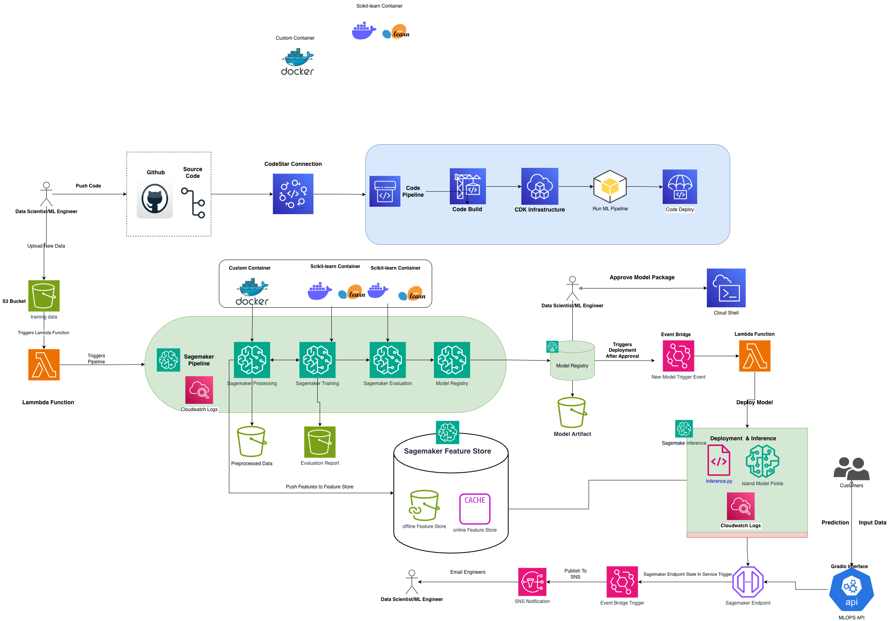

# Telematics Trip Scoring ML Platform

A **production-grade, end-to-end AI/ML platform** that uses **driver telematics data** to predict **trip scores** based on driving behavior.

The system is **event-driven, automated, and designed for continuous learning at scale**.

> This is **not** a demo or notebook project — it is a real ML platform covering data ingestion, feature engineering, model training, deployment, monitoring, and retraining.

---

## 🧠 What This Platform Does

This platform:
- Ingests raw (synthetic) telematics driving data
- Engineers trip-level and driver-level behavioral features
- Trains and evaluates ML models using SageMaker Pipelines
- Registers models with approval workflows
- Deploys approved models to real-time inference endpoints
- Continuously monitors data drift and model performance
- Supports automated retraining and redeployment

---

## 🏗️ System Architecture



The architecture is fully event-driven and built using AWS managed services with Infrastructure as Code.

---

## 🔄 End-to-End Workflow (Current State)

### 1. Data Ingestion (Event-Driven Retraining)
- New telematics data is uploaded to **Amazon S3**
- An **S3 event notification** triggers an **AWS Lambda** function
- The Lambda function starts a **SageMaker Pipeline execution**

✅ Enables automatic model retraining whenever new data arrives

---

### 2. CI/CD Trigger (Code-Driven Retraining)
- Source code is stored in **GitHub**
- A **CodePipeline** (currently created via AWS Console) is connected using **AWS CodeStar**
- On every code push:
  - CodePipeline runs build and validation steps
  - Triggers a **SageMaker Pipeline execution**
  - Ensures models are retrained when pipeline logic or features change

> ⚠️ CodePipeline is currently console-managed.  
> **CDK implementation is coming soon.**

---

### 3. ML Pipeline Execution (SageMaker Pipelines)

The **SageMaker Pipeline** performs:
- Data preprocessing and feature engineering
- Trip-level and driver-level feature creation
- Model training
- Model evaluation
- Model registration in **SageMaker Model Registry**

Models are registered with the status:


---

### 4. Feature Management
- Engineered features are stored in **Amazon SageMaker Feature Store**
- **Offline store** is used for training
- **Online store** supports low-latency inference
- Ensures **feature consistency** between training and inference

---

### 5. Model Approval (Manual Governance Gate)
- Model approval is performed manually using **AWS CloudShell**
- This simulates real-world governance and compliance workflows

```
aws sagemaker update-model-package \
  --model-package-name <MODEL_PACKAGE_ARN> \
  --model-approval-status Approved
```
- After the model is approved in the SageMaker Model Registry, the inference deployment is automatically triggered & hosts a sagemaker endpoint 

### 6. Gradio UI for Real-Time Predictions

A **Gradio-based user interface** is provided to interact with the deployed SageMaker real-time inference endpoint.

The UI allows users to:
- Input trip data
- Send requests to the production inference API
- View **real-time trip score predictions**

The Gradio application communicates directly with the SageMaker endpoint created in the inference deployment step.

To launch the Gradio UI:

```bash
python gradio_app.py
```


